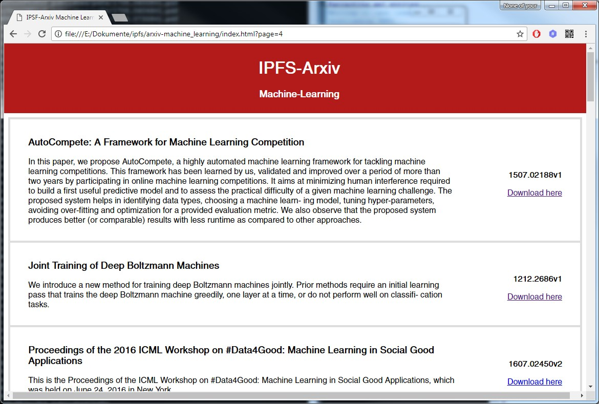
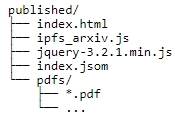

# IPFS-Arxiv
IPFS-Arxiv is hosted via the interplanetary file system protocol. It is a decentralized collection of the newest 1000 machine learning papers from arxiv. Important: All papers are actually uploaded and stored in a decentralized fashion!

https://gateway.ipfs.io/ipns/QmbahoVpU7qr5NWu8SYLP4my3iPnn9skgV7uFkFwXCfYmX/ <br/><br/>
(Just in case the top one doesn't work)
(https://gateway.ipfs.io/ipfs/QmVxheJqLSqJ4VTw2LYwe3UbDYLYhq1RWb3ie43yGYTr8y)
<br/>

# Siraj - IPFS challenge
I have created this site because of two reasons, my primary goal was to create something for IPFS because I think it is amazing and may very well be the future of the internet. And the second reason why I created this particular project at this time is Sirajes IPFS challenge. So Siraj, this is my official submission. (https://www.youtube.com/watch?v=BA2rHlbB5i0)
<br/>

# Description
The project consists of two parts. The first part is a webscraper written in python. It requests machine learning paper search results via the arxiv API. And the second one is the website itself, it reads in the json index generated by the webscraper and displays the results. It also links to the papers contained in the "pdfs" folder.
<br/>

# Webscraper
The webscraper uses the arxiv API to send a search query in this format:<br/>
```
http://export.arxiv.org/api/query?search_query=[query]&start=[start_index]&max_results=[result_count]
```
The query in the machine learning case is "machine%20learning", start_index is a zero based offset index from which paper to start and result_count the amount of results that should be returned.

API results are in xml format so the next step is to parse them and add the titles, ids and summaries (these are all the tags we are using) to the index.json file. There we save all the information but not without checking for doubles, so no redundant entries are being written to the index after a potential restart. Then all pdfs of the non redundant entries are downloaded and saved to the "pdfs/" folder.
PDF request url:<br/>
```
http://arxiv.org/pdf/[paper_id].pdf
```
Yah, paper_id is just the id of the paper!
All the code is in arxiv_scraper.py
<br/>

# Website
The website reads the index.json file generated by the webscraper and creates the website entries from it. The site consists of index.html the main html file, ipfs_arxiv.js creates the entries from json and handles next/prev page management, jquery is completely pointless and pdfs/ contains all the machine learning paper pdfs.
<br/><br/>

<br/>
<br/>

# Instructions
<b>1. Scraping arxiv papers</b>
<br/><br/>
If you want to host your own ipfs-arxiv clone just follow the instructions. First is scraping the PDFs from arxiv with a search query, in this case "machine learning" but you can change it to what ever you want. Just note that you cant use spaces or other certain characters, the query needs to be urlencoded.
```python
raw = get_arxiv(i,length=100,query='machine%20learning')
xml_root = xml(raw)
entries = get_entries(xml_root)
```
In the get_arxiv() function [i] is the start index of the papers you are requesting and [length] the amount you get back, [query] holds the search query for which the API returns the xml entries. Then we parse it into xml and extract the id, title and summary from all the entries.
```python
entries = write_entries_to_index(entries,index_file='index.json')
download_pdfs(entries,folder='pdfs')
```
These two lines are for writing the retrived entries to the index.json file that contains all the entry information we are interested in and download_pdfs downloads the pdfs if they exist from all the entries to the "pdfs/" folder.

<br/>
<br/>
<b>2. The website</b>
<br/><br/>
In the next step we take a look at the website code. The whole site consists of three files and a folder containing all the pdfs; lets first look at index.html it contains all the html and css code of the site plus it loads the javascripts (jquery for no reason, index.json and ipfs_arxiv.js). I wanted to use jquery to load the index.json file into the website so the javascript code could access it, but that didn't work out in chrome because of it's cross-domain protection so I had to get a little creative. I put "var index_json = [index.json content];" around the previously created entry index and loaded it like this:

```
<script src='index.json'></script>
<script type='text/javascript' src='ipfs_arxiv.js'></script>
```
Now that index.json is loaded as a javascript we can just access the index_json variable containing the entire index table as a list of dictionaries. And the second line loads the main js script.
<br/>
ipfs_arxiv.js contains all the javascript code for displaying and managing pages (next/prev and what page we are currently on etc.) and based on the page_index it adds the appropriate entries from index_json to the main display section.
<br/>
The pdfs/ folder contains all the papers we scraped earlier. There are some arxiv entries without a pdf associated to them but at the moment all entries are displayed even the ones without pdfs. In this repo I only uploaded a hand full of pdfs so you can just clone it and try it out but on the real site there are at the moment 1000 papers uploaded (~950MB). 

<br/>
<br/>
<b>3. Host it via IPFS</b>
<br/><br/>
Put all the website files (index.html, ipfs_arxiv.js, jquery, index.json) and the pdfs/ dir in a new folder, I called it published

<br/>
Then if you haven't yet install ipfs from <a href='https://ipfs.io/docs/install/'>here</a> and initialize ipfs

```
ipfs init
```

then start the daemon in a separate terminal

```
ipfs daemon
```

and upload the published folder like this

```
ipfs add -r published/
```

In the output of this you want to take the hash from the last line, it should look like this

```
added QmVxheJqLSqJ4VTw2LYwe3UbDYLYhq1RWb3ie43yGYTr8y published
```

you can now access your ipfs site via your hash either over the online gateway or the daemon running on your machine

```
https://gateway.ipfs.io/ipfs/QmVxheJqLSqJ4VTw2LYwe3UbDYLYhq1RWb3ie43yGYTr8y
http://127.0.0.1:8080/ipfs/QmVxheJqLSqJ4VTw2LYwe3UbDYLYhq1RWb3ie43yGYTr8y
```

<br/>
Congrats you did it :)
<br/>
But if you want to make changes to your site in the future and don't want to give every one that wants to access your site a new hash every time you do there is one last step. Essentially we publish the site hash under our peerID so that the id resolves to our site hash

```
ipfs name publish QmVxheJqLSqJ4VTw2LYwe3UbDYLYhq1RWb3ie43yGYTr8y
ipfs name resolve QmbahoVpU7qr5NWu8SYLP4my3iPnn9skgV7uFkFwXCfYmX
```

the first line connects the site hash to your peerID, the second one is to check if it worked. Now if you want to access your site with the peedID instead change ipfs to ipns in your request url

```
https://gateway.ipfs.io/ipns/QmVxheJqLSqJ4VTw2LYwe3UbDYLYhq1RWb3ie43yGYTr8y
http://127.0.0.1:8080/ipns/QmVxheJqLSqJ4VTw2LYwe3UbDYLYhq1RWb3ie43yGYTr8y
```
<br/>
Thats it!
